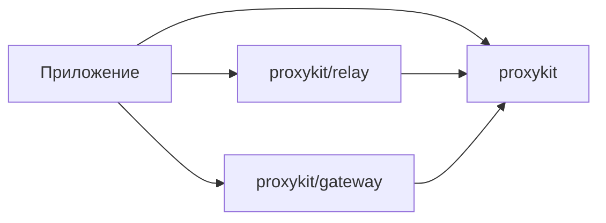

# Архитектура proxykit

Модуль содержит три пакета: основную библиотеку `proxykit`, браузерный адаптер
`relay` и `gateway` для параметров ротационных прокси. Это небольшой Go-модуль: его операции используют общую модель прокси
и один механизм подключения. Публичные определения находятся непосредственно
в пакете, без фасада, type aliases и пересылки вызовов во внутренние пакеты.

## Граница пакетов

Внутри `proxykit` файлы группируют связанную логику. Они не образуют отдельных
слоёв или пространств имён. Валидация рядом со `Spec`, параметры подключения
рядом с `Dialer`, параметры проверки рядом с `Check`. Приватные функции и типы
не входят в контракт библиотеки. Дополнительные пакеты нужны, когда появляется
самостоятельная ответственность, а не просто новый файл.

`relay` владеет локальным HTTP-сервером. Он принимает минимальный интерфейс
`Dialer` с одним `DialContext`; подходит как `*proxykit.Dialer`, так и другой
туннельный транспорт. Основной пакет ничего не знает о браузере и сервере relay.
Зависимость направлена в одну сторону; Go не допускает импортный цикл.

`gateway` преобразует `Spec` в `Spec`: разбирает и собирает теги страны, сессии
и времени жизни в credentials по декларативному `Format`. `Split` и `Apply` не
открывают соединений; `Format.New` повторяет `proxykit.New` и обращается к сети
только для определения отсутствующего протокола. Состояния у пакета нет;
основной пакет о нём не знает.

## Модель и API

| Задача | API |
|---|---|
| Разобрать строку без сети | `Parse`, `ParseWithOptions` |
| Разобрать JSON или список | `ParseJSON`, `ParseLines` |
| Экспортировать endpoint | `Spec.URL`, стандартный JSON |
| Определить неизвестный протокол | `Detect`, `Resolve` |
| Получить готовый диалер из строки | `New(ctx, input, Options)` |
| Создать диалер из конкретного `Spec` | `NewDialer(spec, DialOptions)` |
| Подключиться к цели | `Dialer.DialContext`, `Dialer.Dial` |
| Создать HTTP transport | `Dialer.Transport`, `NewHTTPTransport` |
| Проверить через тот же маршрут | `Dialer.Check(ctx, CheckOptions)` |
| Проверить с параметрами подключения по умолчанию | `Check` |
| Проверить несколько прокси | `CheckAll(ctx, specs, BatchOptions)` |
| Узнать протокол, задержку и страну | `Inspect`, `Dialer.Inspect` |
| Обойти VPN/WARP | `DialOptions.Bypass` |
| Запустить браузерный адаптер | `relay.Start(dialer, relay.Options)` |
| Страна и сессия ротационного прокси | `gateway.Format.Split`, `gateway.Format.Apply` |
| Готовый диалер из строки и параметров | `gateway.Format.New(ctx, input, Params, Options)` |

Парсер нестандартных записей использует декларативный `Layout`: он задаёт
роли полей и точные разделители. В коротких строках `@` связывает только
соседние host/ip и port; остальные поля разделены `:`. Стандартные URL имеют
собственный синтаксис авторизации и обрабатываются отдельно. Общая лексическая обработка держит IPv6 в
скобках одним полем, ограничивает число полей и сохраняет credentials.
`parse_layout.go` содержит эту логику, не обращается к сети и не выбирает
протокол. Явный формат поддерживает все перестановки; авторазбор сохраняет
стандартные соглашения и отклоняет неоднозначные результаты.

`Spec` — значение. Отсутствующий протокол представлен как `Auto`; парсер его
не угадывает по порту. `NewDialer` принимает только конкретный протокол. `New`
для `Auto` сначала проверяет кандидатов через целевые туннели. `Options.Target`
нужен только для такого определения. Явный протокол не вызывает сетевой проверки
при создании. Результат `New` — тот же `Dialer`, без оборачивающего `Client`.

`Dialer` копирует конфигурацию и клонирует proxy TLS config при создании.
`Spec()` отдаёт копию. Его методы подключения, HTTP transport и проверки
используют одни настройки. `CheckOptions` содержит только параметры цели;
изменить через них маршрут рабочего диалера невозможно. В `BatchOptions`
параметры подключения, проверки и число workers заданы отдельно.

## Подключение и протоколы

`Dialer` управляет сокетом: TCP, общий timeout настройки, отмена, TLS к
HTTPS-прокси, proxy handshake, очистка deadline и передача туннеля вызывающему
коду. Приватный `connector` отделяет HTTP/SOCKS5 wire exchange от этого цикла.
`connectorFor` выбирает одну из двух реализаций; глобального registry нет.

HTTP и HTTPS используют HTTP/1.1 CONNECT; у HTTPS перед ним идёт TLS к прокси.
SOCKS5 использует удалённое разрешение имени цели. Протоколы подтверждаются
проверкой авторизации и успешным открытием целевого туннеля. Приветствие сервера
само по себе не считается успешным определением.

`DialOptions.Forward` открывает только соединение с прокси и обязан соблюдать
контекст. Собственный DNS или трассировка подключаются здесь.
`DialOptions.Bypass` — встроенная реализация того же шва: привязка сокета к
физическому интерфейсу и DNS по нему (`bind.go`, системная часть в `bind_*.go`). Остальной жизненный цикл сокета принадлежит библиотеке.

## Владение ресурсами

| Ресурс | Кто закрывает |
|---|---|
| Сокет при ошибке или отмене настройки | `Dialer` |
| Успешно возвращённый TCP-туннель | вызывающий код |
| Пробные туннели, включая проигравшие кандидаты | `Detect` до возврата |
| Проверочный туннель | `Check` до возврата |
| Простой HTTP transport | вызывающий код через `CloseIdleConnections` |
| Listener, запросы и CONNECT-туннели адаптера | `relay.Server.Close` |

У самого `Dialer` нет открытых ресурсов и метода `Close`. Контекст подключения
ограничивает настройку; после возврата туннеля caller управляет его временем
жизни и deadlines. `relay.Server.Close` отменяет ожидающие подключения,
закрывает активные соединения и ждёт завершения обработчиков. Повторные и
параллельные вызовы Close безопасны.

## Ошибки и границы ответственности

`OpError` сохраняет фазу, протокол и status code; исходная ошибка доступна через
`errors.Is/As`. Текст ошибки скрывает credentials и произвольный ответ сервера.
`Spec.String` скрывает авторизацию; URL и JSON экспортируют её намеренно.

Проверка относится к конкретной цели. `gateway` даёт только запись параметров
ротационного прокси; момент смены сессии выбирает приложение. Ротация, хранилище, account assignment,
health TTL, геолокация, расписание и повторные попытки принадлежат приложению.
Нет фоновых workers вне явно вызванного `CheckAll`, прямого fallback или
скрытых обращений к сервисам определения IP.

## Проверка контракта

Unit-тесты расположены рядом с кодом. Тесты внешнего пакета `proxykit_test`
используют публичный API и настоящие локальные TCP/TLS fixtures. Они проверяют
протоколы, ошибки, отмену, границы worker pool и жизненный цикл relay. Примеры
в `examples/` компилируются вместе с модулем. CI запускает vet и race tests;
локально доступны coverage и fuzz-тест парсера.
